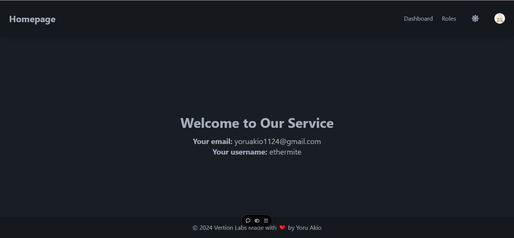
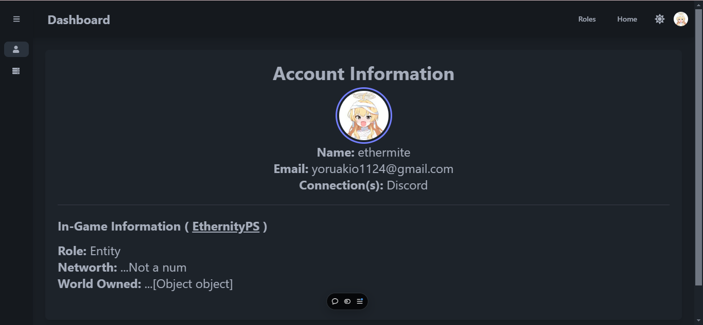
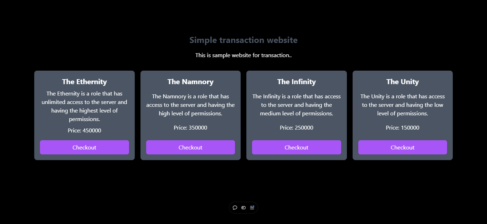
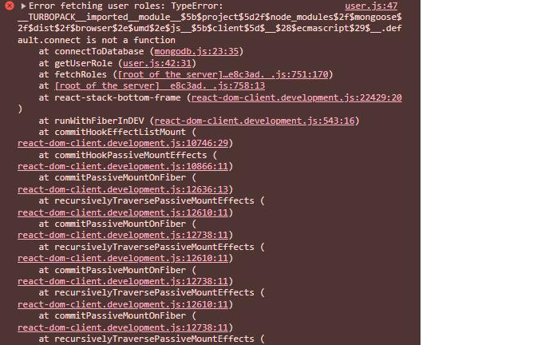

# GTDashboard

Growtopia Dashboard is a web application that allows users to manage their accounts, view server information, and view their in-game information. It is designed to be a user-friendly and intuitive interface for managing their accounts and accessing their server information. The application is built using Next.js, Clerk, MidTrans, and MongoDB.

## Note

This project is still in development and may not be fully functional. and this repo might be not maintained. I'm not responsible for any issues that may arise from using this project.

## Table of Contents

- [GTDashboard](#gtdashboard)
  - [Note](#note)
  - [Table of Contents](#table-of-contents)
  - [Getting Started](#getting-started)
  - [Environment Variables and Configuration](#environment-variables-and-configuration)
  - [Features](#features)
  - [Screenshots](#screenshots)
    - [Homepage](#homepage)
    - [Dashboard](#dashboard)
    - [Roles](#roles)
    - [Error that i had, and makes me sad :(](#error-that-i-had-and-makes-me-sad-)
  - [Contact](#contact)
  - [Contributing](#contributing)
  - [Acknowledgments](#acknowledgments)
  - [License](#license)

## Getting Started

To get started with the project, follow these steps:

```sh
# Clone the repository
git clone https://github.com/YoruAkio/GTDashboard.git

# Navigate to the project directory
cd GTDashboard

# Install dependencies
npm install

# Start the development server
npm run dev
```

## Environment Variables and Configuration

The application requires the following environment variables to be set:

- `CLERK_SECRET`: The secret key for your Clerk project.
- `CLERK_API_URL`: The URL of your Clerk API.
- `CLERK_WEBHOOK_SECRET`: The secret key for your Clerk webhook.
- `MONGODB_URI`: The connection string for your MongoDB database.
- `MIDTRANS_CLIENT_KEY`: The API key for your MidTrans account.
- `MIDTRANS_CLIENT_SECRET`: The API secret for your MidTrans account.
- `NEXT_PULIC_API`: The API key for your Next Public API.

You can copy the `.env.example` file and rename it to `.env` to set these variables.

## Features

- User authentication using Clerk
- Server information viewing
- In-game information viewing
- User management via Clerk

## Screenshots

### Homepage


### Dashboard


### Roles



### Error that i had, and makes me sad :(


## Contact

- Telegram: [@YoruAkio](https://t.me/YoruAkio)
- Nakai Community: [Discord](https://discord.com/invite/ESsBxptJqr)

## Contributing

Contributions are welcome! If you have any suggestions or improvements, please open an issue or submit a pull request.

## Acknowledgments

I would like to thank the developers of Clerk, MidTrans, and Next Public API for their open-source projects that have been instrumental in the development of this project.

## License

This project is licensed under the MIT License. See the [LICENSE](LICENSE) file for more information.